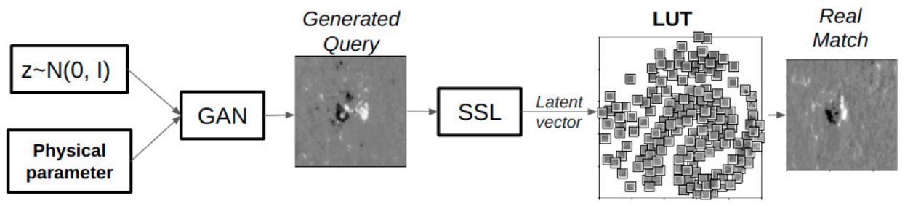
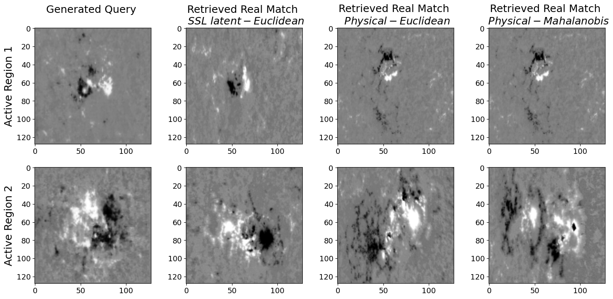

# Generative_Interrogator
* Designed and implemented combining GAN, SVM, and SSL
* Controls Synthetic Data Generation from Physical Space
* Queries Generated Data to Retrieve Real Matches
* Demonstrated on Space-weather HMI Active Region Patches (SHARPs)
* [Arxiv link](https://arxiv.org/abs/2502.05351)

